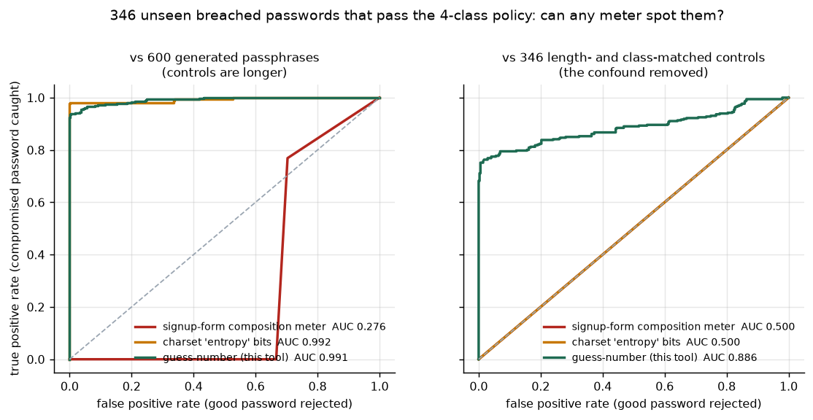

# Password Strength Analyzer

**M Jaswanth Kumar** — Thiranex Cyber Security internship, task 1.

A password strength analyser that scores how many guesses an attacker needs, rather
than counting character classes. It checks candidates against a million real breached
passwords and against the live Have I Been Pwned corpus without disclosing the password,
keeps a re-use history that catches suffix-increment rotation, and generates alternatives
from a CSPRNG.

The interesting part is not the tool. It is that the tool comes with an evaluation which
can show, on ground truth, that the meter every signup form ships is not merely useless
but **inverted** — under a fair test it ranks compromised passwords as *stronger* than
genuine passphrases.

## The problem with the usual approach

Two things get called "password strength" in practice:

1. **A composition meter.** Points for length, plus a point per character class present.
   `P@ssw0rd1` earns five of six and displays as *Strong*.
2. **Charset "entropy".** `length × log2(charset)`, banded with a table that came out of
   NIST SP 800-63 Appendix A — withdrawn in 2017, still quoted everywhere. `P@ssw0rd1`
   scores 59 bits, or *Reasonable*.

Both describe the shape of a string. Neither asks the only question that predicts
survival: **has anyone typed this before?** `P@ssw0rd1` appears in the Have I Been Pwned
corpus **253,616 times**. Live, from this repo:

```
$ python -m src.analyze --password "P@ssw0rd1"

  Verdict         : Weak  (guess-number score 1/4)
  Estimated guesses: 10^4.9

  What the naive meters say about the same string
    signup-form composition meter : Strong (5/6)   <-- calls it strong
    charset 'entropy'             : 59.1 bits, Reasonable

  Time to guess
    online, rate-limited endpoint (10/s, assumed)        2 hours
    offline, unsalted SHA-1, 1 GPU (5e10/s, assumed)     instantly
    offline, Argon2id RFC 9106 (16.0/s, measured here)   1 hour

  Why (cheapest decomposition an attacker would use)
     8 char(s)  dictionary:breach      10^3.6 guesses  [rank 2136]
     1 char(s)  bruteforce             10^1.0 guesses

  Breach check    : FOUND 253,616 times in HIBP (query hidden among 1968 hashes)
```

## Data

Real corpora only. Nothing here is synthesised.

| source | what it is | role |
|---|---|---|
| SecLists `Pwdb_top-1000000.txt` | 1,000,000 passwords ranked by observed frequency across public breach compilations | the attacker's wordlist |
| SecLists `darkweb2017_top-10000.txt` | 9,999 passwords from a separate dark-web dump | evaluation set |
| `google-10000-english` | frequency-ranked English vocabulary | dictionary matching |
| EFF large wordlist | 7,776 diceware words | passphrase generation, *and* a dictionary the estimator must assume the attacker owns |
| Have I Been Pwned range API | live breach corpus, k-anonymity queries | the "prevent re-use" check |

`python -m src.corpus` fetches all four (~9 MB). `data/raw/` is gitignored; the scored
outputs in `data/processed/` are committed.

**The evaluation needs no labelling.** Every password in a breach dump is compromised by
definition, so a meter that calls one of them *Strong* is provably wrong about that
password. No opinion about what "strength" means is required.

## How the estimator works

A from-scratch implementation of the guess-number idea from Wheeler's *zxcvbn: Low-Budget
Password Strength Estimation* (USENIX Security 2016). Not a port — the matchers, the
per-pattern guess counts and the search are written here, against the corpora above.

Each candidate is carved into recognised patterns: breach-corpus hits (cost ≈ the entry's
rank), dictionary words with capitalisation and leet mangling priced in, keyboard walks
over a real QWERTY adjacency graph, constant-step sequences, repeats, dates, and
brute-force runs as the fallback. An attacker pays the product of the per-pattern costs
plus a `k!` term for not knowing the assembly order, so the estimate is the cheapest such
decomposition. The search is exact: a DP keeps the best product for every
(prefix, pattern-count) pair, so `k!` is applied to the right product instead of being
folded into a greedy choice.

## Findings

Full report with every number: [outputs/reports/findings.md](outputs/reports/findings.md).
Reproduce with `python -m src.evaluate` — byte-identical across runs, verified.

### 1. I was wrong about composition policies, and say so

I expected composition rules to wave most of a breach corpus through. They do not:

| policy | approves | share of the 1M corpus |
|---|---|---|
| len ≥ 8 | 577,789 | 57.78% |
| len ≥ 8 + 3 of 4 classes | 42,540 | 4.25% |
| len ≥ 8 + all 4 classes | **591** | **0.06%** |
| len ≥ 12 + all 4 classes | 133 | 0.01% |

A strict four-class policy is a reasonably effective filter against a frequency-ranked
dump. The problem is the 591 survivors, and that the meter cannot rank them: correlation
between composition score and actual guess count is **0.363** (Spearman), and **0.287**
for charset bits. A policy is a gate, not a measurement.

### 2. The trap: a held-out corpus that is not held out

`darkweb2017_top-10000.txt` looks like an independent test set. It is not — **98.75%** of
it (9,874 of 9,999) also appears in the training corpus. A corpus-lookup estimator scores
those from memory, so any headline number over that file measures wordlist recall.

On the 125 genuinely-absent entries the weak-flag rate falls from 100% to 55.2%. That is
the finding, but n=125 is too thin to publish, so the split was rebuilt by rank — the
estimator gets breach ranks 1–500,000 and is tested on 6,000 sampled from the 500,000
below the cutoff:

| estimator's corpus | n | flags weak | median estimate |
|---|---|---|---|
| contains the test passwords | 6,000 | **99.95%** | 10^5.78 |
| does not contain them | 6,000 | **79.83%** | 10^6.01 |

The second row is the number this tool can actually claim. The gap is how much of a
corpus-lookup meter's apparent skill is lookup.

### 3. The operational test, and the inverted meter

A signup form runs its policy filter and then has to judge whatever passed. So: 346
breached passwords that pass the four-class policy **and** sit outside the estimator's
dictionary, against 600 generated passwords.

| meter | AUC (vs generated) | AUC (length- and class-matched) |
|---|---|---|
| signup-form composition meter | **0.277** | **0.500** |
| charset "entropy" bits | 0.992 | **0.500** |
| guess-number (this tool) | 0.991 | **0.886** |

The composition meter scores **0.277** — below 0.5, so it is not uninformative, it is
inverted. It rates the compromised passwords as *stronger*, because a breached `Abcd123!`
carries four character classes while `plywood-cactus-ferry-oxidant` carries two and gets
marked down to *Medium*. It labels **100%** of the compromised set *Strong*.

Charset entropy looks excellent in the left column, at 0.992. That number is a length
artefact: the controls average 25 characters against 10.5 for the breached group, so any
length-sensitive score wins by default. The right column removes the confound — each
control is regenerated at exactly the length of a real breached password, with all four
classes, so mean charset entropy is **69.0 bits in both groups**. Both naive meters land
on exactly **0.500**, scoring ties all the way down. The structural estimator still
separates them, 10^7.94 against 10^16.41 guesses at the median.

That is the experiment the project turns on: strip away length and composition, and the
naive meters have nothing left.



### 4. Calibration, including where this estimator is wrong

For generated passwords the true guess space is arithmetic, so the error is measurable:

| generator | true space | estimated (median) | error |
|---|---|---|---|
| diceware-4 | 10^15.56 | 10^21.96 | **+6.40 orders** |
| diceware-6 | 10^23.34 | 10^35.69 | +12.34 orders |
| diceware-4, no separators | 10^15.56 | 10^15.08 | **−0.49 orders** |
| random-20 | 10^39.46 | 10^35.64 | −3.82 orders |

Separated passphrases are over-scored by six orders of magnitude, and the cause is
identifiable rather than mysterious: dropping the separators moves the same generator to
−0.49. The excess is the estimator charging for hyphens it treats as unknown characters,
plus the ordering penalty on a longer pattern list. An attacker who knows the generator
emits `word-word-word-word` pays neither. Pricing the estimator's own ignorance as
strength is the one direction of error worth fixing.

Long random strings go the other way, under-scored by 3.82 orders, because the search
finds incidental dictionary fragments inside random text and takes the cheaper
decomposition. Understating a strong password is the safe direction, so it stands.

### 5. Where this tool itself fails

Fifteen policy-compliant breached passwords, checked against the live HIBP API. All
fifteen are confirmed compromised — and the guess-number estimator rates **nine of them
Strong or Very strong**:

| password | composition meter | charset bits | HIBP sightings | this tool |
|---|---|---|---|---|
| `Hello@123` | Strong | 59.1 | 341,404 | Weak |
| `Apple@123` | Strong | 59.1 | 254,316 | Weak |
| `!Q2w3e4r5t` | Strong | 65.7 | 42,799 | Moderate |
| `Qazigund@1` | Strong | 65.7 | 846 | **Very strong** |
| `wArdog-1kill` | Very strong | 78.8 | 872 | **Very strong** |

`Qazigund@1` is a place name plus a suffix; `wArdog-1kill` is a mangled phrase. Held out
of the dictionaries, neither decomposes into anything the estimator recognises.

This is the argument for the tool's layering, not a footnote. Structural estimation caught
6 of 15; the breach lookup caught 15 of 15. A guess-number model reasons about the
passwords people *tend* to build; a real corpus knows the ones they *did* build. Shipping
either alone would have been the mistake, which is why **breach membership overrides the
score rather than contributing to it**.

## Decisions worth defending

**Breach membership overrides everything.** Not a signal blended into a score. If a
password is in a corpus, its guess count is roughly its rank and no amount of character
variety changes that. Finding 5 is why.

**k-anonymity, never the password and never the full hash.** The HIBP check sends the
first five hex characters of the SHA-1 and nothing else; the server returns every suffix
under that prefix (~1,968 for `P@ssw0rd1`) and cannot tell which was asked about. Requests
carry `Add-Padding: true` so response size leaks nothing either. A strength checker that
posts the password to a third party has created a worse problem than the one it solved.

**No composition rules are enforced.** They correlate 0.363 with actual guessability, and
NIST SP 800-63B dropped them for pushing users toward predictable shapes. The checklist
this tool prints follows 800-63B: length, printability, a 64-character minimum ceiling,
breach absence. No mandatory classes, no forced rotation.

**Suggestions are never mangled out of the user's password.** Appending digits,
capitalising the first letter, `a`→`@` — those are the first rules in hashcat's
`best64.rule`. A password "repaired" that way is no harder to guess than the one it
replaced, so every alternative is drawn independently from `secrets` and its guess space
stated up front. See `NEVER_DO_THIS` in [src/suggest.py](src/suggest.py).

**The EFF wordlist is given to the attacker.** This tool hands out EFF passphrases, so an
attacker targeting its users starts with that list. Scoring passphrases as though the
wordlist were secret would be self-serving.

**The history table stores a keyed root HMAC, and that is a deliberate weakening.**
Argon2id hashes alone catch exact re-use and nothing else, so `Summer2024!` →
`Summer2025!` sails through — the first mutation any ruleset applies. Alongside each hash
the table keeps an HMAC-SHA256 of the password's *skeleton* (leet folded back, trailing
digits and punctuation trimmed), with the key in a separate file. It buckets passwords
sharing a root, which does leak something, and is accepted because blocking
suffix-increment re-use is worth more in practice. `track_skeletons=False` turns it off.

**Crack times are always per attack model.** Two of the three rates are measured on this
machine (`python -m src.benchmark`): SHA-1 at 1,612,141 h/s single-threaded, Argon2id at
16.0 h/s. That factor of **100,917 on identical hardware** is the whole argument for a
memory-hard KDF. The GPU figure is labelled an assumption everywhere it appears, because a
GPU cluster cannot be benchmarked from a laptop.

## The re-use check, running

From [outputs/reports/demo_session.txt](outputs/reports/demo_session.txt) via
`python -m src.demo`:

```
Retiring the passwords she has already used:
  id 1: 'Summer2024!'  ->  skeleton 'summer'

  'Summer2024!'   REJECTED - exact re-use (history id 1)
  'Summer2025!'   REJECTED - shares a root with id(s) [1]
  'Summer2024!!'  REJECTED - shares a root with id(s) [1]
  'Summ3r2025!'   REJECTED - shares a root with id(s) [1]
  'Spring2025!'   ACCEPTED by history check      <-- the blind spot
  'plywood-cactus-ferry-oxidant'  ACCEPTED
```

`Spring2025!` is the honest limitation: root matching compares roots, and `spring` is not
`summer`. Catching it needs a similarity sketch over plaintext, which leaks materially
more than a root HMAC. The line is drawn at the mutation the rulesets automate.

Writing this demo is also what surfaced a real bug: the leet table maps digits onto
letters (`2`→`z`, `0`→`o`, `4`→`a`), so folding before trimming turned `Summer2024!` into
`summerzozai` and the trailing-digit trim found nothing to remove. Order fixed in
[src/history.py](src/history.py); the comment there records why.

## Running it

```bash
pip install -r requirements.txt
python -m src.corpus        # fetch the corpora (~9 MB)
python -m src.benchmark     # measure hash rates on this machine

python -m src.analyze                                    # prompts, stays out of shell history
python -m src.analyze --password "hunter2" --no-suggest   # demo mode, warns
python -m src.analyze --history data/history.db --user alice
python -m src.analyze --offline                          # corpus only, no network

python -m src.demo          # password-history walkthrough
python -m src.evaluate      # the full evaluation: figures, findings.md, summary_stats.json
```

Reproducible: seed 20260821, pinned `requirements.txt`, and `summary_stats.json` is
byte-identical across runs (verified by hash). The shipped suggester draws from `secrets`
and deliberately cannot be seeded, so the evaluation builds its own controls from a seeded
`random.Random`; nothing it generates is ever offered to a user.

## Layout

```
src/corpus.py      corpus download and loading
src/guessing.py    the guess-number estimator: matchers + exact DP search
src/naive.py       the two meters being tested, reproduced faithfully
src/pwned.py       HIBP k-anonymity client
src/history.py     Argon2id history + keyed skeleton HMAC
src/suggest.py     CSPRNG alternatives, and why none are derived from the input
src/benchmark.py   measures hash rates on this machine
src/analyze.py     CLI
src/evaluate.py    the six experiments, figures and reports
src/demo.py        history walkthrough
outputs/figures/   5 generated charts
outputs/reports/   findings.md, summary_stats.json, hash_rates.json, demo_session.txt
data/processed/    scored CSVs
```

## References

- NIST SP 800-63B, *Digital Identity Guidelines: Authentication and Lifecycle Management*,
  §3.1.1.2 (memorized secrets)
- D. Wheeler, *zxcvbn: Low-Budget Password Strength Estimation*, USENIX Security 2016
- RFC 9106, *Argon2 Memory-Hard Function*, §4 (parameter recommendations)
- Have I Been Pwned Pwned Passwords range API (k-anonymity model)
- SecLists (danielmiessler/SecLists) — password corpora
