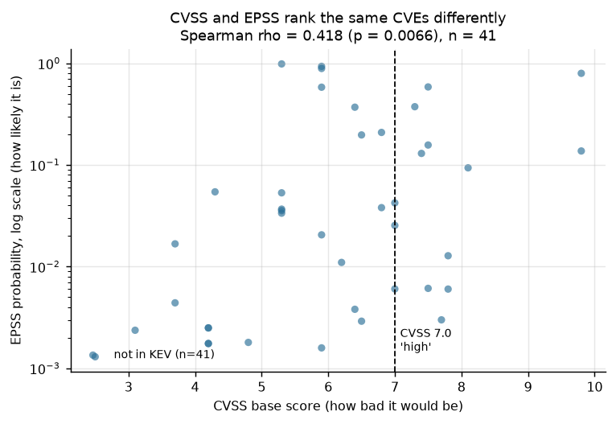
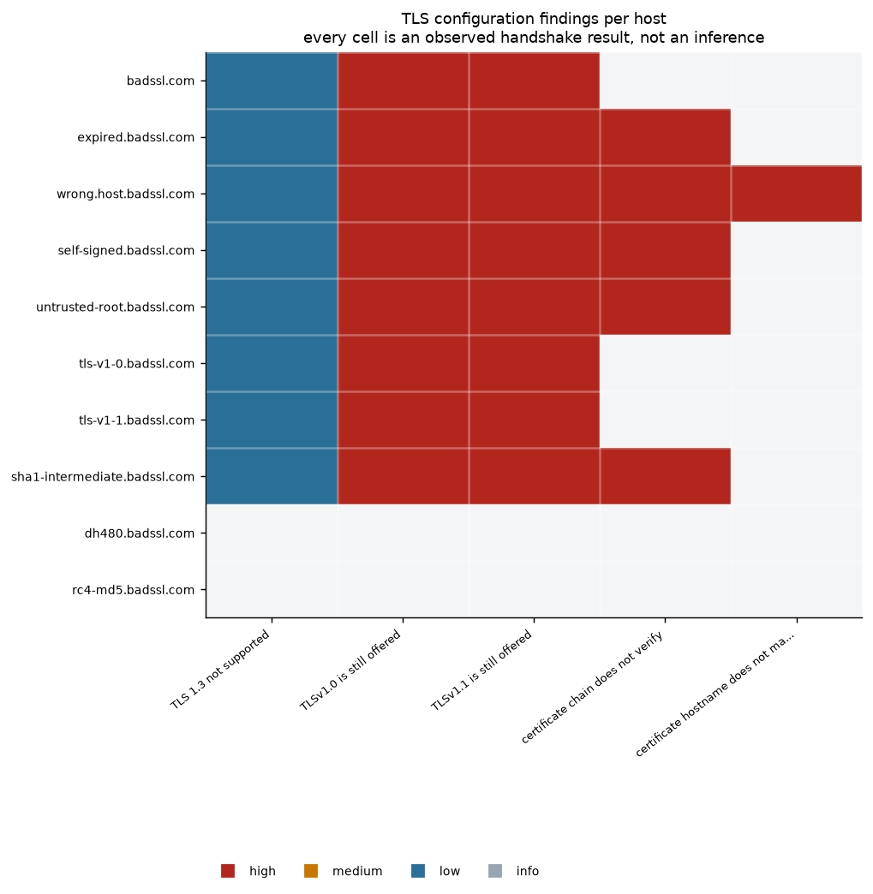

# Vulnerability Scanner

**M Jaswanth Kumar** — Thiranex Cyber Security internship, task 2.

A pure-Python scanner that connect-scans authorised hosts, fingerprints the services it
finds, reviews TLS and HTTP configuration, and correlates versions against the NVD CVE
database, the CISA Known Exploited Vulnerabilities catalogue and FIRST's EPSS scores. No
nmap, no external tooling, no administrator rights.

It found real defects on every target it was pointed at. It also produced two false
results during development, caught both with control probes, and the write-up of *those*
is the most useful thing in the project — because a scanner nobody can trust is worse than
no scanner at all.

## What it does

```
python -m src.scan
```

Five phases: TCP connect scan → control probes → TLS review → HTTP header review → CVE
correlation → report. One run of the committed configuration produced:

| | |
|---|---|
| Hosts port-scanned | `127.0.0.1`, `scanme.nmap.org` |
| Open ports (after controls) | 7 |
| Services fingerprinted to product + version | 1 of 7 |
| TLS endpoints checked | 10 (22 high-severity findings) |
| HTTP targets checked | 4 (7 high, 6 medium, 8 low) |
| CVEs matched by version range | 41 |
| ...of those, in CISA KEV | **0** |
| Run time | 126s (first run; feed responses cached afterwards) |

Full generated report: [outputs/reports/findings.md](outputs/reports/findings.md).

## Scope is enforced in code, not documented in a footnote

Port scanning a host you do not control is somewhere between rude and illegal depending on
jurisdiction, so `--target` does not exist. [src/scope.py](src/scope.py) holds an allowlist
and every check consults it before a packet is sent:

- `127.0.0.1` — this machine.
- `scanme.nmap.org` — published by the Nmap project explicitly for scan practice. Their
  standing request is to keep the load light, so remote scans use 8 workers, 80 ms
  spacing and a 21-port list rather than 72.
- `*.badssl.com` — purpose-built to serve broken TLS.
- `httpbin.org`, `example.com` — HTTP header review only.

Those last two sit behind a second, stricter gate. Fetching a public page is an ordinary
request that every visitor makes; enumerating a host's open ports is not. So
`PORTSCAN_AUTHORISED` is a subset of `AUTHORISED`, and `assert_portscannable()` raises on
anything outside it. Adding a target means editing the file, which means making a decision.

## Observed versus inferred

The report separates two kinds of claim, because conflating them is how scanners lose
credibility.

**Observed** — a completed handshake, a certificate's `notAfter`, a header that is present
or absent. Facts about the target. Re-running gives the same answer.

**Inferred** — "this version has CVEs". That chains three assumptions: the banner is
truthful, the CPE mapping is right, and the vulnerable code path is reachable in this
deployment. An unauthenticated scan verifies none of them.

Sections 1–3 of the report are the first kind. Section 4 is the second, and says so.

## The trap: version-to-CVE matching is a false-positive machine

`scanme.nmap.org:22` answers:

```
SSH-2.0-OpenSSH_6.6.1p1 Ubuntu-2ubuntu2.13
```

Query NVD for `cpe:2.3:a:openbsd:openssh:6.6.1p1` and **41 CVEs** come back, 14 of them
CVSS ≥ 7.0. A scanner that stops there emits 14 "high severity" tickets.

All 41 are flagged `unconfirmed` by this tool, because of `Ubuntu-2ubuntu2.13`. NVD's
version ranges track *upstream* releases. Debian and Ubuntu backport security fixes
without moving the upstream version string, so every CVE fixed in a later upstream release
still matches this banner even when the running binary already contains the patch. The
banner cannot distinguish the two cases and neither can any unauthenticated scanner. The
correct next step is `dpkg -l openssh-server` on the host, not a patch ticket.

`src/triage.py` therefore attaches a confidence level and its reasoning to every finding,
and `pct_unconfirmed` — **100.0%** for this run — is reported as a headline number rather
than buried.

### CVSS is not a priority order

Across the 41 matched CVEs, the rank correlation between CVSS base score and EPSS is
**ρ = 0.418** (p = 0.0066, n = 41). Positive and statistically significant, and nowhere
near an ordering you could substitute one for the other.



The single most likely-to-be-exploited CVE in the set is **CVE-2018-15473 at EPSS 0.9863**
— a 98.6% modelled probability of exploitation activity — and its CVSS is **5.3, MEDIUM**.
It is an OpenSSH user-enumeration bug: low impact per the CVSS rubric, trivially
scriptable, and consequently automated everywhere. Sort by CVSS and it lands below
CVE-2016-10012 (7.8 HIGH, EPSS 0.0128) and CVE-2015-8325 (7.8 HIGH, EPSS 0.0060).

Median EPSS is 0.068 for the CVSS-high group against 0.021 for the rest — so CVSS does
carry signal, roughly a factor of three. It just is not the ranking. CVSS scores how bad
exploitation *would* be; EPSS estimates whether anyone *will*. This scanner sorts by KEV
membership, then EPSS, then CVSS.

**And zero of the 41 are in CISA KEV.** Worth stating plainly rather than treating as a
clean bill of health: KEV requires evidence of confirmed in-the-wild exploitation and is
deliberately conservative. Absence from it is absence of *confirmation*, not absence of
risk — CVE-2018-15473 at 98.6% EPSS is not in KEV either.

## The two false results, and the controls that caught them

### 1. The scanner's own TLS stack hid the vulnerability

The first run reported no deprecated protocol versions anywhere — including on
`tls-v1-0.badssl.com` and `tls-v1-1.badssl.com`, hosts that exist for no purpose other
than serving them.

The servers were fine. OpenSSL 3.0 ships at security level 1, which removes every cipher
suite TLS 1.0 and 1.1 can use, so pinning those versions fails with
`NO_CIPHERS_AVAILABLE` before any handshake happens. My probe treated every handshake
failure as "the server refused" and recorded a clean result.

Re-probing with `set_ciphers("ALL:@SECLEVEL=0")` found TLS 1.0 **and** 1.1 live on
`tls-v1-0.badssl.com`, `tls-v1-1.badssl.com` and — unexpectedly — on `badssl.com` itself,
the host I had picked as the correctly-configured control.

The general lesson outlives the bug: **a hardened scanner produces false negatives about
weak configuration, because it refuses to speak the protocol it is meant to detect.**
`TlsResult` now records `versions_needing_weakened_client`, so each finding states whether
the client had to be weakened to observe it — the server is still offering the version
either way.

### 2. Ports that were never there

The first run also reported POP3 (110) and IMAP (143) open on `scanme.nmap.org`, while
port 80 — which that host genuinely serves — timed out. The same two ports showed open on
`127.0.0.1`.

Neither result was a property of either machine. The loopback banner settled it:

```
127.0.0.1:110  ->  -ERR Can not connect to e-mail server. Error:100502
127.0.0.1:143  ->  BAD Can not connect to e-mail server. Error:100502
```

A real POP3 daemon does not say that. This is a mail-scanning security product on this
machine accepting the connection on port 110's behalf and reporting that *it* could not
reach a mail server upstream. It answers for remote addresses too, which is why
`scanme.nmap.org:110` looked open.

A TCP connect scan cannot distinguish "the target accepted my connection" from "something
on the path accepted it". So [src/control.py](src/control.py) runs two controls before
anything is reported:

- **Closed-port control** — four unregistered high ports per host, which must be refused.
  If they answer, every open port for that host is unreliable. Both hosts passed.
- **Interception detection** — banner signatures that identify a local proxy, plus a
  cross-host coincidence rule (the same silent port open on both loopback and an unrelated
  remote host is better explained by an interceptor than by a shared coincidence).

Ports 110 and 143 are now excluded from findings on both hosts, with the evidence recorded.
This is the failure mode that matters in a scan report: not a missed vulnerability, but a
confident finding about a service that never existed.

## TLS and HTTP findings

22 high-severity TLS findings across 10 endpoints, all observed rather than inferred.
Two are worth calling out:

- **`wrong.host.badssl.com`** presents a certificate that is entirely valid — correctly
  issued, in date, properly chained — and still fails, because it was issued for a
  different name. Validity and applicability are separate questions and checking only the
  first is a common, serious mistake.
- **TLS 1.0/1.1 still negotiating** is not merely dated. RFC 8996 (March 2021) deprecated
  both outright, so continuing to offer them is a live misconfiguration.

`dh480.badssl.com` and `rc4-md5.badssl.com` are unreachable from here — the client cannot
complete a 480-bit DH or RC4-MD5 handshake at all. That is reported as *unreachable*, not
as *secure*, which is the same distinction as the SECLEVEL bug above.



One header is deliberately **not** flagged when missing: `X-XSS-Protection`. Chrome removed
the XSS auditor in 2019, the header is retired, and its filter could itself be abused to
suppress legitimate script. Reporting its absence would be following a checklist instead of
reasoning. The `Server:` and `X-Powered-By` disclosure findings are what connect this
section to the CVE work — a version number in a header is exactly the input a CVE lookup
needs, which is why suppressing it is worth doing even though it fixes no bug.

## Decisions worth defending

**Connect scan, not SYN scan.** Slower and noisier, needs no raw sockets or admin rights,
and completing the handshake is what lets a service identify itself. The cost is stated:
filtered and closed ports are indistinguishable here.

**A curated 72-port list, not 1–65535.** Scanning fewer ports well beats scanning all of
them badly, and it keeps the remote target's load defensible.

**`virtualMatchString`, not keyword search.** NVD applies its own CPE matching, so
`openssh:6.6.1` also picks up advisories recorded as "affects < 7.4". Keyword search
cannot: querying the literal text `OpenSSH 6.6.1` returns **zero** results. That kind of
silent false negative is worse than a noisy false positive, because nothing in the output
hints at it.

**CPE mapping is hand-maintained, and that is the honest state of the art.** NVD analysts
assign CPE names and they are not derivable from a banner — nginx appears as both
`nginx:nginx` and `f5:nginx` depending on when the advisory was written, so both are tried.
An unmapped product yields zero CVEs, which looks identical to "clean", so unmapped
services are listed explicitly in the report rather than omitted.

**The CVSS metric version travels with the score.** 39 of the 41 findings carry CVSS v3.1,
one v3.0, one only v2. The v2 scale is not comparable to v3, so the numbers are never
averaged or silently mixed.

**Six of seven open ports could not be fingerprinted, and the report says so.** Silence in
a scan report reads as "clean". Unidentified services and skipped lookups each get a row
and a reason.

**No exploitation is attempted.** Nothing here is proven exploitable, only matched.

## Running it

```bash
pip install -r requirements.txt
python -m src.scan                  # full run; NVD/KEV/EPSS responses cached to data/raw
python -m src.scan --offline        # replay from cache, no network
python -m src.scan --skip-remote    # localhost only
python -m src.scan --skip-tls --skip-http
```

The NVD API allows 5 requests per rolling 30 seconds without a key, so `feeds.py` throttles
to one request every 6.5 s and caches everything on disk. First run ~126 s; later runs are
near-instant.

`cryptography` is optional. Installed, certificate key size and signature algorithm are
reported; absent, those two fields report nothing rather than guessing.

## Layout

```
src/scope.py       the authorisation allowlist, enforced before any packet
src/portscan.py    TCP connect scan, banner grab, service fingerprinting
src/control.py     closed-port and interception controls
src/tlscheck.py    TLS version probing, certificate and cipher review
src/httpcheck.py   security response headers, disclosure, cookie flags
src/feeds.py       NVD 2.0, CISA KEV, FIRST EPSS clients with on-disk cache
src/triage.py      CPE mapping, CVE correlation, confidence and the triage funnel
src/report.py      findings.md, summary_stats.json, figures
src/scan.py        orchestrator
outputs/figures/   5 generated charts
outputs/reports/   findings.md, summary_stats.json
data/processed/    services, TLS, HTTP, CVE and control results as JSON
```

## References

- NVD CVE API 2.0 — `virtualMatchString` CPE matching
- CISA Known Exploited Vulnerabilities catalogue
- FIRST EPSS (Exploit Prediction Scoring System)
- RFC 8996, *Deprecating TLS 1.0 and TLS 1.1* (March 2021)
- RFC 2606, *Reserved Top Level DNS Names* (`example.com`)
- OWASP Secure Headers Project
- Nmap legal issues / `scanme.nmap.org` scanning policy
