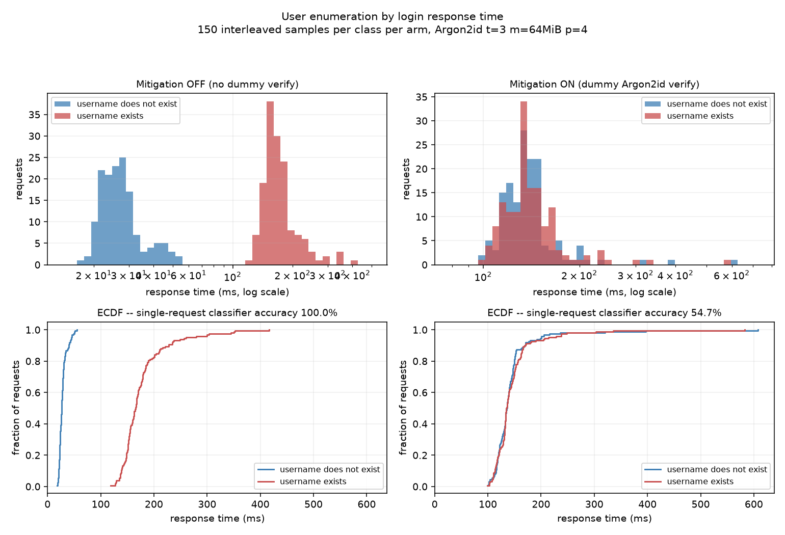
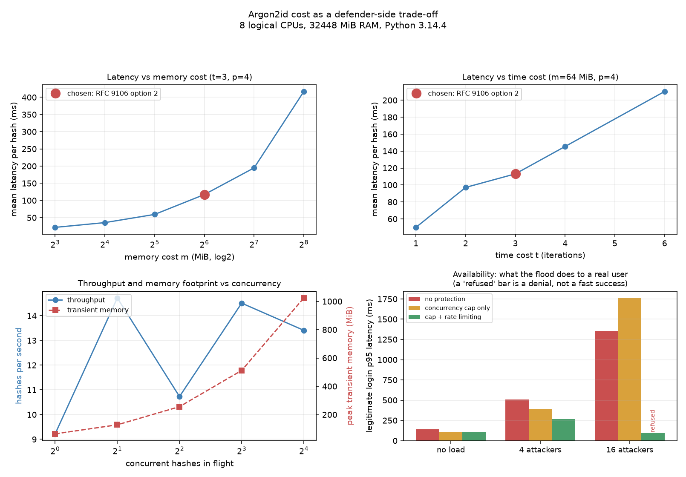

# Secure Login System

**M Jaswanth Kumar** — Cyber Security internship, project 04.

A working Flask + SQLite login application: registration, login, TOTP second
factor, logout, and a protected page. Passwords are hashed with Argon2id at the
RFC 9106 parameters, queries are parameterised, sessions live server-side and are
rotated on every privilege change, and the TOTP implementation is written from the
RFCs and checked against their published test vectors.

The part I would actually want reviewed is not the feature list. It is the three
attacks that a login form passes a feature checklist while still being wide open
to — user enumeration by response timing, session fixation, and the memory cost of
a good password hash being an availability problem — each of which is measured
here, before and after the fix, with the numbers in
[`outputs/reports/findings.md`](outputs/reports/findings.md).

Two of those measurements came out differently from what I expected. Both are
written up as such rather than reshaped.

---

## Contents

- [What it does](#what-it-does)
- [How to run it](#how-to-run-it)
- [Threat model](#threat-model)
- [Design decisions and why](#design-decisions-and-why)
- [The three traps, measured](#the-three-traps-measured)
- [Verification](#verification)
- [Layout](#layout)
- [Known limitations](#known-limitations)
- [References](#references)

---

## What it does

| | |
|---|---|
| Registration | Username and password rules with stated reasons, NFKC normalisation, Have I Been Pwned breach check over the k-anonymity range API |
| Password hashing | Argon2id, t=3, m=64 MiB, p=4, 128-bit salt, 256-bit tag (RFC 9106 section 4, second recommended option), with automatic re-hash at login when stored parameters are weaker than current ones |
| Login | Parameterised SQL, one generic failure message and status code for every failure mode, dummy-hash verify on the unknown-user path, per-username and per-IP rate limiting, cap on concurrent hashes |
| Second factor | TOTP built from `hmac`/`hashlib`/`struct`, two-phase enrolment, replay prevention via a stored counter, ±1 step skew window |
| Sessions | Opaque 256-bit identifier in the cookie, SHA-256 of it in the database, rotation on every privilege change, idle and absolute timeouts, real server-side invalidation on logout |
| Protected page | Requires an `authenticated` session; a session that stopped at the password step reaches nothing |
| Contrast target | `/demo/vulnerable/login`, string-concatenated SQL over plaintext passwords, mounted only behind an explicit flag |

## How to run it

Python 3.14 on Windows 11 is what this was built and measured on. PowerShell 5.1
has no `&&`, so commands are separated with `;`.

```powershell
python -m pip install -r requirements.txt

# Print the effective security configuration and exit.
python run.py --print-config

# Run it. Plain HTTP over loopback needs --insecure-cookies, because a Secure
# cookie is not sent to an http:// origin, so no browser could ever log in.
python run.py --insecure-cookies
# then open http://127.0.0.1:5000/
```

The whole test suite, which starts real servers and drives them over HTTP:

```powershell
python tests\run_all.py
```

Individual suites, each runnable on its own:

```powershell
python tests\test_rfc_vectors.py        # RFC 4226 / 6238 vectors, offline, instant
python tests\test_sqli.py               # 390 SecLists payloads at two targets
python tests\test_enumeration.py        # timing measurement + figure
python tests\test_session_fixation.py   # fixation, rotation, invalidation
python tests\test_session_lifecycle.py  # cookie flags, timeouts, CSRF
python tests\test_lockout.py            # rate limiting
python tests\test_validation.py         # rules, Argon2 params, HIBP
python tests\test_e2e.py                # live transcript into outputs/reports/
```

The Argon2 cost measurement and its figure:

```powershell
python bench\bench_argon2.py
```

`tests/test_sqli.py`, `tests/test_validation.py` and `tests/test_e2e.py` reach the
network (SecLists and the HIBP API). `test_sqli.py` caches the payload corpus
under `.cache/` so a repeat run works offline; the HIBP check fails open and says
so.

### Configuration

Everything security-relevant is in `src/config.py`, one constant per decision with
its reason attached. Overridable by environment variable (`SLS_*`) or by the flags
`run.py --help` lists. The flags that weaken the app exist only so the measurement
harnesses can produce a before/after comparison, and each one prints a warning at
startup:

- `--insecure-cookies` — clears the cookie `Secure` flag. Development only.
- `--no-rate-limit` — needed by suites that fire hundreds of requests.
- `--no-enum-mitigation` — reintroduces the timing leak so it can be measured.
- `--no-breach-check` — offline use.
- `--demo-vulnerable` — **mounts an authentication bypass by design.** See below.

### The secret key

`app.secret_key` comes from `SLS_SECRET_KEY` if set, otherwise
`secrets.token_bytes(32)` at startup. No key is written to disk or committed, and
`.gitignore` excludes `*.db`, `.env`, `*.pem`, `*.key` and friends.

Worth being precise about: because authentication state is **not** carried in a
signed cookie, this key is not what protects a session. The 256-bit opaque
identifier and the server-side `sessions` table are. `/healthz` reports which
source the key came from and never its value.

### The deliberately vulnerable endpoint

`--demo-vulnerable` mounts `POST /demo/vulnerable/login`, which builds SQL by
string concatenation from request data against a table of **plaintext** passwords.
It is an authentication bypass by design and exists purely as the control group in
the injection experiment: without a vulnerable target, "no payload got in" only
proves the payloads were fired at something.

It is off unless the flag is passed, it lives in its own table no other code path
reads, it refuses to serve unless the config flag is set even if the blueprint
were registered by mistake, the app prints a warning banner at startup, and every
response from it carries an `X-Danger` header. Do not expose that process to a
network you do not own.

## Threat model

Who I assumed I was defending against, because a control only makes sense against
a stated attacker.

**In scope:**

| Attacker | Capability | Primary control |
|---|---|---|
| Unauthenticated remote attacker | Can send arbitrary HTTP to any endpoint at will | Parameterised queries, generic failure responses, rate limiting, concurrency cap, CSRF tokens |
| Credential-stuffing operator | Holds breach corpora; wants to know which usernames exist here before spending guesses | Constant-time-shaped login responses, identical messages and status codes, lockout keyed on the submitted string |
| Attacker who has read the database | Stolen backup, SQL-injected dump, leaked log | Argon2id at 64 MiB, per-user random salt, SHA-256 of session ids rather than the ids |
| Attacker who can plant a cookie | Session fixation via a subdomain, a link, or XSS elsewhere on the origin | New session identifier on every privilege change, old row deleted |
| Attacker who observes one code in transit | Shoulder-surf, phish, logging proxy | TOTP replay prevention with a stored counter, narrow skew window |
| Attacker who wants the service down | Can send concurrent unauthenticated requests | Rate limiting and a cap on concurrent Argon2 operations — **partially effective, see finding 6** |

**Out of scope, and why:**

- **TLS.** The app sets `Secure` on its cookies and assumes something in front
  terminates TLS. Running it on plain HTTP requires an explicit flag that prints a
  warning.
- **Phishing and real-time relay of TOTP codes.** TOTP is a shared-secret scheme;
  a user who types a code into an attacker's page is compromised for that step,
  and no amount of server-side care fixes it. WebAuthn is the answer to that, and
  it is a different project.
- **Account recovery.** There is no password reset or "forgot my 2FA" flow. Those
  are usually the weakest part of a real system and building one properly needs an
  email or SMS channel this project does not have. Leaving it out is honest;
  building a bad one would not be.
- **A compromised server.** If the attacker runs code on the box, they have the
  plaintext at the moment of login and nothing here helps.
- **Client-side malware and XSS elsewhere on the origin.** `HttpOnly` and a
  restrictive CSP raise the cost; they do not make it zero.

## Design decisions and why

**Argon2id rather than bcrypt.** bcrypt silently truncates at 72 bytes, so a long
passphrase has its tail ignored and the user is never told. Its memory footprint
is about 4 KiB, which fits in a GPU core's local memory, so a GPU or FPGA attacker
gets a very large parallel speed-up; Argon2's memory cost is the specific defence
against that, because 10000 GPU cores at 64 MiB each is 625 GiB of RAM the
attacker does not have. Argon2**id** is the hybrid — data-independent first
half-pass for side-channel resistance, data-dependent thereafter — which is what
RFC 9106 section 4 point 3 says to choose when side channels are a plausible
threat.

**The second recommended parameters, not the first.** RFC 9106's first
recommendation is t=1, p=4, m=2^21 (2 GiB). That cannot be served concurrently on
ordinary hardware: two simultaneous logins would hold 4 GiB. The second
recommendation — t=3, p=4, m=2^16 (64 MiB) — is the one designed for exactly this
constraint, and the measured curves in finding 5 show why: 256 MiB already costs
417 ms per hash on this machine, so 2 GiB is not a login latency, it is a timeout.

**Sessions server-side, not in a signed cookie.** Flask's default session puts the
state in the cookie and signs it. The server keeps nothing, so "log out" can only
mean asking the browser nicely; anyone who copied the cookie first still holds a
valid session and there is no row to delete. Server-side invalidation requires the
server to hold the authoritative record, so the cookie carries an opaque
identifier and nothing else.

**The database stores SHA-256 of the session id.** Same reasoning as password
hashes: a leaked backup or an injected dump should not hand over live sessions. No
work factor, because a 256-bit random value has no dictionary to attack. It also
means the lookup is a primary-key hit on a hash, so no comparison timing leaks.

**`auth_level` on the session, so the second factor is real.** A session is
`anonymous`, then `pending_2fa` once the password checks out, then
`authenticated`. Protected routes demand `authenticated`. Storing "the password
was correct" anywhere the client controls is the standard way this gets broken.

**Validation is not the injection defence.** Parameterised queries are. The login
endpoint deliberately does not filter quotes, and it deliberately does not reject
on validation rules either — a form that answers "username must be at least 3
characters" for one input and "invalid credentials" for another has told the
attacker which strings are even candidate usernames. The username charset is
narrow for different reasons (impersonation, log injection, display), and the app
would still be injection-proof with it wide open. `tests/test_sqli.py` fires the
whole corpus at the password field, which accepts any printable character.

**No password composition rules.** NIST SP 800-63B section 5.1.1.2 says verifiers
should not impose them. They produce `Password1!` and buy nothing measurable. A
12-character floor (8 is a 2017 figure and offline cracking has not got slower), a
128-character ceiling to bound what gets fed to Argon2, and a breach check
instead — which is what the same section recommends.

**Fail open on the breach check.** If HIBP is unreachable, registration proceeds
and the app logs it. Failing closed converts someone else's outage into ours, and
this check is defence in depth on top of the length floor and Argon2id rather than
the thing holding the door. For a system where account takeover is expensive I
would fail closed and accept the outage; the code returns `available` so the
caller can tell the cases apart.

**`SameSite=Lax`, not `Strict`.** Strict breaks clicking a link in an email and
arriving logged in. Lax already blocks the cross-site POST that CSRF needs, and a
synchroniser token is carried as well.

**`remote_addr` only, never `X-Forwarded-For`.** That header is client-controlled.
Trusting it without a known proxy in front lets an attacker rotate it and walk
straight past the per-IP limiter.

**Two-phase 2FA enrolment.** The secret is stored on the GET, but the factor is
not switched on until a code verifies. Otherwise a mistyped or mis-scanned secret
locks the account owner out of their own account. Enabling it also evicts every
other session for that user: if someone else was logged in as you, adding a second
factor should throw them out.

## The three traps, measured

Full numbers, tables and reasoning in
[`outputs/reports/findings.md`](outputs/reports/findings.md). Headlines:

### 1. User enumeration by response timing

Without the fix, an existing username answered in a median of **108.2 ms** and an
absent one in **19.3 ms** — an **88.9 ms** gap, Cohen's d **6.38**, and a
single-request threshold classifier that identified accounts with **100.0 %**
accuracy. Identical error text does not help; the clock is the oracle.

With a dummy Argon2id verify on the unknown-user path: gap **-3.2 ms**, d
**0.067**, classifier **51.3 %** — chance. Note the residual is slightly
*negative* rather than zero; at that effect size it is noise, and the suite
asserts the property that matters (accuracy below 70 %) rather than pretending the
gap is exactly zero.



A related trap the same suite caught: a lockout keyed on a *resolved user id*
would have reopened the leak from a different direction, since only real accounts
can be locked. It is keyed on the submitted string instead, and both a real and a
non-existent username lock out after exactly 5 failures with identical status
sequences.

### 2. Session fixation

The session identifier is regenerated on every privilege change and the old row is
**deleted**. Verified three ways rather than one: the identifiers differ, the old
row is gone from the table (checked by opening the SQLite file read-only), and
re-presenting the pre-login cookie by hand returns 401 while the victim's own new
session returns 200. With 2FA on, a login walks three distinct identifiers,
`anonymous` → `pending_2fa` → `authenticated`, each superseded row deleted and
each superseded cookie refused.

### 3. Argon2 memory cost as a DoS vector

64 MiB per verify on an unauthenticated endpoint means peak memory is set by
whoever sends the most requests. Measured: 16 concurrent hashes hold **1 GiB** and
push per-hash latency past **1.1 s**, and threading buys at most about **1.7x**
throughput on 8 logical cores — so concurrency here costs latency and memory and
returns almost nothing.



Under a flood, a legitimate user's login p95 went to **9.82x** baseline with no
protection. **Neither mitigation fixed that**, and this is the part I would lead
with in a review:

- The **concurrency cap** bounds peak memory to 256 MiB instead of 1 GiB, which is
  real, but it made the victim's p95 **worse** (16.79x) because they now queue
  behind the attackers rather than competing with them.
- **Rate limiting** produced an apparently perfect p95 of 0.93x baseline — which
  turned out to be the victim being served **429 with a 0 % login success rate**.
  The per-IP limiter had tripped on the attackers' traffic and the legitimate user
  shared their address. I only caught it because the benchmark was changed to
  record the victim's status code and not just their latency.

So: the controls move the failure mode around rather than removing it. Unbounded
memory growth, or bounded memory plus queuing latency, or a hard refusal. What
this actually needs is a different shape of control — per-IP *concurrency*
fairness rather than per-IP failure counting, a proof-of-work step so an attempt
costs the attacker something too, a separate queue for requests already carrying a
valid session, and the Argon2 work moved off the request-handling loop. The
parameter choice is defensible; the availability story is bounded and documented,
not solved.

## Verification

Everything was run. `python tests\run_all.py`:

```
  [OK  ] RFC 4226 / RFC 6238 test vectors: 92/92 (0.001s)
  [OK  ] Validation, Argon2 parameters, HIBP breach check: 63/63 (3.687s)
  [OK  ] Session lifecycle: cookies, timeouts, CSRF: 28/28 (16.945s)
  [OK  ] Rate limiting and lockout: 10/10 (7.426s)
  [OK  ] Session fixation and rotation: 29/29 (18.885s)
  [OK  ] End-to-end: register, login, 2FA, protected page, logout: 24/24 (29.242s)
  [OK  ] SQL injection: SecLists corpus: 13/13 (91.864s)
  [OK  ] User enumeration timing: 13/13 (80.333s)

  272/272 checks passed, 0 failed, 248.8s total
```

**RFC vectors, 92/92.** Every HOTP value and intermediate HMAC from RFC 4226
Appendix D Tables 1 and 2, and all 18 TOTP values from RFC 6238 Appendix B across
SHA1/SHA256/SHA512. The suite also asserts the known RFC 6238 erratum (ID 2866):
the 20-byte seed named in the prose does **not** reproduce the SHA256 and SHA512
rows, which were generated with the 32- and 64-byte seeds from the Appendix A
reference code.

**SQL injection.** 390 unique payloads from three SecLists files, fired into both
the username and the password field at each of two targets — 780 requests per
target, 1560 total.

| target | authenticated | 5xx |
|---|---|---|
| `POST /login`, parameterised | **0 / 780** | **0** |
| `POST /demo/vulnerable/login`, concatenated | **52 / 780** | 206 driver errors |

A fresh account registered and logged in afterwards, so nothing was dropped. One
caveat stated rather than glossed: `sqlite3` refuses multi-statement `execute()`,
so stacked payloads like `'; DROP TABLE users; --` cannot destroy anything even on
the vulnerable endpoint. That is the driver, not the code being safe — the
authentication bypass, which is the thing that matters for a login form, works
normally.

**Live end-to-end transcript.** Registration (including a real HIBP call and a
real rejection of a breached password), login, session rotation, 2FA enrolment,
logout, fresh login through the second factor, a refused replay of the code just
used, the protected page, and a final logout after which the old cookie is
re-presented by hand and refused. Captured verbatim in
[`outputs/reports/session_transcript.md`](outputs/reports/session_transcript.md),
with session ids, CSRF tokens, TOTP secrets and passwords redacted.

**A bug the tests found, and did not paper over.** The first end-to-end run failed
at "valid TOTP code completes authentication". The cause was correct behaviour:
confirming enrolment consumes a code, so the replay guard refuses a code from that
same 30-second step at the next login. The app was right and the test was wrong.
The test now waits for the counter to advance, with a comment explaining why
loosening the replay guard would have been the wrong fix. Same story in the
benchmark: the first version's parameter sweeps contradicted each other because a
throttling laptop confounded the parameter axis with wall-clock time, so the
sweeps were rewritten to interleave in a random order per round with an explicit
drift probe.

## Layout

```
04-secure-login-system/
  run.py                     entry point and flags
  requirements.txt           pinned to what is actually installed
  src/
    app.py                   routes; HTML or JSON from the same auth logic
    config.py                every security constant, each with its reason
    db.py                    SQLite; parameterised statements only
    passwords.py             Argon2id, the dummy verify, the concurrency cap
    totp.py                  HOTP/TOTP from hmac, hashlib, struct
    sessions.py              server-side sessions, rotation, timeouts
    validation.py            input rules with stated reasons
    ratelimit.py             lockout keyed on the submitted string
    hibp.py                  k-anonymity range API client
    vulnerable_demo.py       the control group. Flag-gated. Read the header.
    templates/, static/      minimal server-rendered UI, no external assets
  tests/
    harness.py               ~90-line pass/fail harness, no pytest needed
    server.py                starts real servers, drives them over HTTP
    run_all.py               runs everything, writes summary_stats.json
    test_rfc_vectors.py      RFC 4226 / 6238 vectors
    test_sqli.py             SecLists corpus at both targets
    test_enumeration.py      timing measurement, both arms, + figure
    test_session_fixation.py fixation, rotation, invalidation
    test_session_lifecycle.py cookie flags, idle + absolute timeouts, CSRF
    test_lockout.py          rate limiting, and what it costs
    test_validation.py       rules, Argon2 parameters, HIBP properties
    test_e2e.py              live drive + transcript
  bench/
    bench_argon2.py          cost curves, concurrency, availability under load
  outputs/
    figures/                 enumeration_timing.png, argon2_cost.png
    reports/                 findings.md, summary_stats.json,
                             session_transcript.md, argon2_bench.json,
                             sqli_payloads_fired.txt, run logs
```

## Known limitations

Stated because a review should not have to find them.

1. **Availability under flood is not solved.** See finding 6. Bounded and
   documented, not fixed.
2. **The per-IP limiter punishes shared addresses.** Measured here, where all
   traffic is loopback, it denied the legitimate user outright. The same happens
   behind CGNAT or a corporate egress. It is retained because it is the only thing
   here that catches spraying across many usernames, but it would need replacing
   with a per-IP concurrency limit or a challenge step before real deployment.
3. **Lockout enables targeted denial of service** against a known username. The
   deliberate trade-off for not leaking which usernames exist; bounded by the
   15-minute duration and cleared by a successful login.
4. **No account recovery.** No password reset, no 2FA recovery codes. A user who
   loses their authenticator is locked out permanently. Recovery flows are usually
   the weakest part of a real system and building one properly needs a channel
   this project does not have.
5. **Flask's development server.** `run.py` uses it, which is fine for
   measurement on loopback and not fine in production. It also means the
   measurements include a dev-server overhead of roughly 25 ms per request, which
   is measured and reported rather than assumed away.
6. **Registration leaks whether a username is taken** (409 on conflict). It has to
   in order to tell two people apart. Hiding it needs an email round-trip that is
   out of scope; the mitigation is that *login* stays silent, which is where the
   leak would actually buy an attacker something.
7. **TOTP secrets are stored in plaintext in the database.** Encrypting them needs
   a key management story — a key that is not in the same database — and doing that
   badly would be worse than not doing it. Called out rather than half-built.
8. **Absolute numbers are this-machine figures.** A shared laptop with a
   throttling mobile CPU. The curve shapes, ratios and before/after comparisons
   are the portable findings; the millisecond values are not.

## References

Real specifications, used as specifications rather than cited decoratively.

- **RFC 9106**, *Argon2 Memory-Hard Function for Password Hashing and Proof-of-Work
  Applications*, section 4. The second recommended option is quoted verbatim in
  `src/config.py` and its parameters asserted in `tests/test_validation.py`.
- **RFC 4226**, *HOTP: An HMAC-Based One-Time Password Algorithm*. Section 5.3 for
  the algorithm, section 7.2 for the resynchronisation and replay requirements,
  Appendix D for the test vectors.
- **RFC 6238**, *TOTP: Time-Based One-Time Password Algorithm*. Section 4.2 for the
  time counter, section 5.2 for the validation window, Appendix B for the test
  vectors, Appendix A for the reference seeds the SHA256/SHA512 vectors actually
  need (Errata ID 2866).
- **NIST SP 800-63B**, *Digital Identity Guidelines: Authentication and Lifecycle
  Management*, section 5.1.1.2 — length floors, the recommendation against
  composition rules, Unicode normalisation, and checking against breach corpora.
- **Have I Been Pwned Pwned Passwords range API** —
  `https://api.pwnedpasswords.com/range/{prefix}` with `Add-Padding: true`.
- **SecLists**, `Fuzzing/Databases/SQLi/` — `Generic-SQLi.txt`,
  `sqli.auth.bypass.txt`, `quick-SQLi.txt`.
- **OWASP Session Management Cheat Sheet** — session rotation on privilege change,
  idle and absolute timeouts, cookie attributes.
